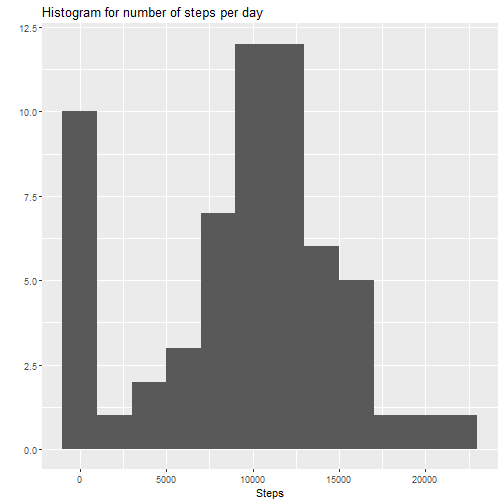
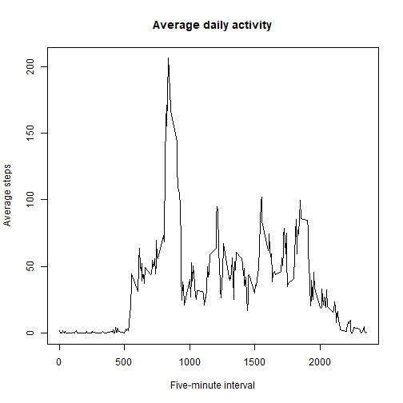
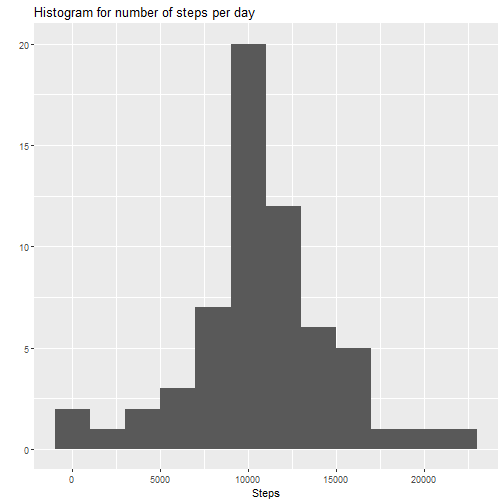
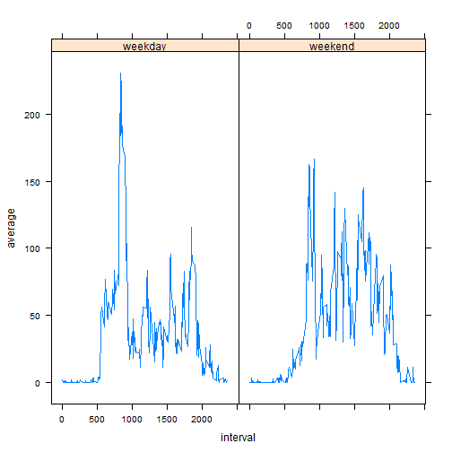

Welcome to Project 2
====================

Let's load some data! This chunk will get us ready to go:


```r
library(dplyr)
library(ggplot2)
library(lattice)
a <- read.csv("activity.csv")
```
Now on to the questions.  

##What is mean total number of steps taken per day?

Prepare the chart:


```r
perday <- group_by(a, date) %>% summarise(total = sum(steps, na.rm=TRUE))
qplot(perday$total, binwidth=2000, main="Histogram for number of steps per day", xlab="Steps")
```



Mean number of steps per day: 9354.2295082  
Median number of steps per day: 10395  

##What is the average daily activity pattern?


```r
daily <- group_by(a, interval) %>% summarise(avg = mean(steps, na.rm=TRUE))
plot(daily$interval, daily$avg, type="l", ylab="Average steps", xlab="Five-minute interval", main="Average daily activity")
```



##Imputing missing values  

Total number of missing values: 2304  

Impute the dataset using the mean of the 5-minute interval to replace NA:

```r
a2 <- a
a2$steps[match(a2$interval, daily$interval) & is.na(a2$steps)] <- daily$avg
```

Chart the daily steps and give the mean and median:

```r
perday2 <- group_by(a2, date) %>% summarise(total = sum(steps, na.rm=TRUE))
qplot(perday2$total, binwidth=2000, main="Histogram for number of steps per day", xlab="Steps")
```



Mean number of steps per day: 1.0766189 &times; 10<sup>4</sup>  
Median number of steps per day: 1.0766189 &times; 10<sup>4</sup> 
  
The values do differ from the earlier functions, which simply ignored the NA values. The median appears to have gone down significantly which may result from the addition of many smaller values. The bins of the histogram have shifted.  

##Are there differences in activity patterns between weekdays and weekends?


```r
wdays <- c("Monday", "Tuesday", "Wednesday", "Thursday", "Friday")
a2 <- mutate(a2, weekday = factor((weekdays(as.Date(a$date)) %in% wdays), levels=c(TRUE, FALSE), labels=c("weekday", "weekend")))

intv <- group_by(a2, weekday)
intv <- group_by(intv, interval, add=TRUE)
intvs <- summarise(intv, average=mean(steps))
xyplot(average~interval|weekday, data=intvs, type="l")
```


